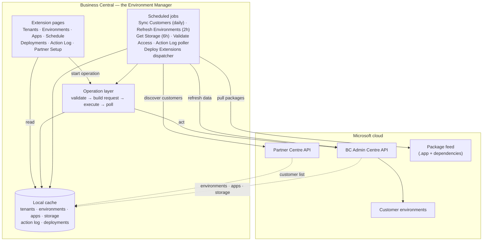
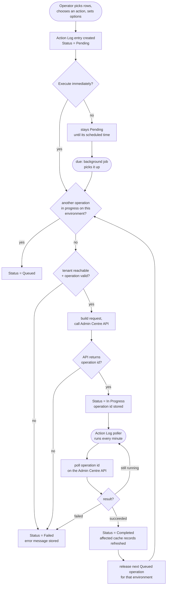

## TL;DR

If you look after Business Central for more than a handful of customers, every
tenant is its own login and every upgrade, app update, or sandbox copy is the
same short click sequence in a different browser tab. I got tired of that, so I
built the **Environment Manager** — a single Business Central extension
that gives me one list of every customer tenant, environment, and installed app;
bulk operations across many environments at once; scheduled upgrades and
extension rollouts; and one action log that records what ran, against what, by
whom, and when. This is a tour of what I built and why it's put together the way
it is.

## The problem with one-tenant-at-a-time

Managing environments by hand doesn't fail dramatically — it just quietly stops
scaling. There's no single view of which customers are near their storage quota
or which environments are a version behind. Routine work multiplies: rolling one
app update to twelve customers is the same dialog, twelve times, with twelve
chances to pick the wrong environment. Slow operations — a copy or restore can
take thirty minutes or more — pull you back to a browser tab you keep flicking
between instead of getting on with something else. And activity is scattered:
the admin centre records what happened, but per environment, per tenant, with no
single place to see everything that's run across the estate this week.

## What you can see

Before any of the operations, the extension just gives me a single place to look
at the estate. That part alone earned its keep.

- **Customer tenants.** Every customer with capacity and storage summaries,
colour-coded so anything near a quota stands out.
- **Environments.** Every environment across every tenant, with its type,
current version, and whether an update is waiting. Production environments are
shown in bold; an upgrade due within a few days shows amber.
- **Apps per environment.** What's installed, and what has a newer version
available.

The refresh happens on its own. Scheduled background jobs refresh environment
details every couple of hours and check storage a few times a day, on top of a
daily customer sync. New environments simply appear. You can also refresh any
single tenant or environment on demand when you need the very latest.

## What you can do: operations

Each operation follows the same pattern: select one or more rows, set only the
options that matter, choose whether to run now or leave it **Pending**, then
monitor it in the Action Log. The available environment operations are:

| Operation                   | What it does                                                                              |
| ---------------------------- | ------------------------------------------------------------------------------------------ |
| Copy                        | Creates a new environment from an existing one, with a chosen name and environment type.  |
| Restore                     | Creates an environment from a selected point in another environment's restore history.    |
| Recover                     | Brings a soft-deleted environment back before permanent deletion.                         |
| Delete                      | Removes an eligible environment, with extra protection around production.                 |
| Set target version and date | Chooses the next platform version and when the upgrade should run.                        |
| Set update time             | Defines the preferred daily window for updates.                                           |
| Reschedule upgrade          | Moves an upgrade that already has a date, with an option to ignore the normal window.      |
| Set app update cadence      | Controls whether apps update by default or alongside major or minor environment upgrades. |
| Deploy extensions           | Uploads an `.app` file or deploys selected products from the package feed.                |

Apps have their own focused actions once you drill into an environment:

| Operation                 | What it does                                                                                           |
| -------------------------- | -------------------------------------------------------------------------------------------------------- |
| Refresh apps              | Reloads the installed apps and available versions for the selected environments.                       |
| Upgrade apps              | Updates selected apps that have a newer Microsoft-managed version available, now or on a schedule.      |
| Cancel app update         | Cancels a scheduled app update before it runs.                                                          |
| Uninstall apps            | Removes selected apps, optionally with dependants and app data.                                         |
| Upgrade from package feed | Rolls selected per-tenant extensions forward to the latest approved package and resolves dependencies.  |

Because the actions start from selected rows, the same choices can be applied to
many environments or apps in one pass rather than repeated customer by customer.

## A worked example: deploying an extension to many customers

Rolling a product out to a set of customers ties the whole thing together.

1. Select the target environments, choose **Deploy Extension**, and either upload
an `.app` package or pick products from a configured package feed.
2. On close, the tool reads the package's dependency graph, pulls any missing
dependencies from the feed, and builds a **batch** ordered so prerequisites
install first. Anything it cannot resolve becomes a warning, not a dead stop —
the rest of the batch still goes ahead.
3. A background dispatcher runs the batch **one deployment at a time per
environment**, uploads each package, then polls the Admin Centre until it
finishes.
4. Progress is visible on a dedicated **Extension Deployments** page, each row
moving `Scheduled → Uploading → Installing → Completed`. A failed row keeps its
error message and a **Retry** action.

Each deployment moves through the same lifecycle: `Scheduled` when queued,
`Uploading` once the dispatcher picks it up, `Installing` once the package
reaches the environment, and `Completed` when the Admin Centre confirms it.
Along the way it can be `Cancelled` by an operator, `Skipped` if the version is
already installed, or `Failed` — in which case a **Retry** action puts it back to
`Scheduled`.

Each deployment is also an entry in the same Action Log as everything else, so it
is audited and retained exactly like a copy or a restore.

## How it's built

I wanted the tool to live where I already spend my day rather than in a separate
system, so I built it as a set of pages inside Business Central, backed
by two things working together:

1. **A local cache** — copies of every customer tenant, environment, installed
app, and storage figure, kept current by background jobs that run on a
schedule.
2. **The live Microsoft APIs** — the Partner Centre API and the Business Central
Admin Centre API remain the source of truth. The extension never replaces them;
it orchestrates them and records what happened.

That split ended up being the whole design in one sentence: **read from the cache
so the UI is fast, act through the APIs so the changes are real, and log
everything in between.**

## The spine: one action log for everything

Every operation — a copy, a restore, an app update, an extension deployment — is
written to a single **Action Log** as it happens. Newest first, with the status,
the operation type, a plain-language description, what it ran against, who ran it,
and when.

- 🟡 **In Progress** — the API is working on it
- 🟢 **Completed** — done
- 🔴 **Failed** — with the actual error message, plus the request that was sent
and the response that came back
- ⏸️ **Pending** — logged but not sent yet
- 🕓 **Queued** — waiting for another operation on the same environment to finish
first

The log is pruned automatically after a set retention period, so it stays useful
without growing forever.

This is the part I enjoyed building most. The log *is* the state machine. A
long operation returns an ID; a background poller periodically checks that ID and
updates the row. And because the Admin Centre API refuses to run two operations
against the same environment at once, extra requests aren't rejected and lost —
they sit as **Queued** and are released one by one as each in-flight operation
finishes. Multi-select stays safe even when every row targets the same
environment.

## Where the customer list comes from: syncing from Partner Centre

The extension is only useful if it knows about every customer, so the first job it
runs is discovery. A scheduled **Sync Customers** job calls the Partner Centre
API once a day and writes the result into the local Customer Tenant table —
adding tenants that are new, updating ones that have changed. I never type a
customer in by hand; if they're in Partner Centre, they show up in the extension
the next morning.

Partner Centre access uses Microsoft's Secure Application Model, so there's a
one-time consent step that produces a refresh token. After that the token rotates
itself on every use and I don't touch it again unless Partner Centre calls start
failing.

Discovery only gets you the *list*, though. Reading a tenant's environments and
storage needs separate per-tenant credentials against the Admin Centre API, and
that's the one part still done by hand: for each newly discovered tenant I set
its authentication — either its own app registration or a shared one reused
across several customers. A background **Validate Tenant Access** job then checks
each tenant and marks it 🟢 Accessible, 🟡 Access Denied, or ⚪ Unknown.

That status matters because the environment and storage refresh jobs **only
process tenants marked Accessible**. A tenant stuck on Access Denied or Unknown
is a visible flag on the tenant list telling me its credentials need attention —
nothing about that customer refreshes until it's fixed.

## The safety rails

Since I'd be the one running bulk operations across real customer tenants, I
wanted the tool to stop invalid operations before they start rather than after
they fail.

- Production environments cannot be casually deleted — the check has to be
deliberately cleared.
- Restore, copy and recover are only offered on environments that can actually
accept them.
- *Upgrade app* is hidden when no update exists.
- Package size limits and invalid scheduling combinations are flagged in the
dialog, with a clear message, not surfaced as an API error minutes later.

If an operation doesn't apply to the selected row, the button is disabled or the
row is filtered out.

## Why build it this way

The payoff for me was direct: the manual estate work became a few clicks with a
paper trail, and the slow operations now look after themselves while I do
something else.

The more interesting outcome is that, once I stripped the project back, it turned
out to be four ideas that fit almost any multi-tenant admin tool on the platform:

- **A local cache kept fresh by scheduled jobs**, so the UI never waits on a
remote API.
- **An action log as the operational spine** — one table that is both the audit
trail and the work queue.
- **A background poller** that turns long-running async operations into a status
you can watch.
- **Per-environment serialization**, so bulk actions cannot trip over the API's
own concurrency limits.

None of those are large pieces on their own. Together they turned a chore I had
been doing by hand for months into an extension I would happily hand to someone on
their first week — which, for a side project, is about as good an outcome as I
was hoping for.

## Where it could go next

Because the cache already holds a normalised copy of every tenant, environment,
app version, and storage figure, most of the obvious extensions are just more
tables next to the ones already there:

- **Licensing.** Pull subscription and per-user licence assignments from the
Partner Centre alongside the environment data, so you can see entitlement
against actual usage per customer — seats paid for versus seats active, add-ons
assigned to the right tenants, renewals coming up.
- **Reporting and dashboards.** The cache tables are ordinary Business Central
data, so exposing them as API pages or reading them straight from the database
gives Power BI (or any reporting tool) an estate-wide dataset with no extra
plumbing: version spread across customers, storage trends, upgrade compliance,
operation volumes and failure rates from the action log.
- **Alerting.** The same scheduled jobs that refresh the cache are a natural
place to raise a notification when a customer crosses a storage threshold, an
environment falls two versions behind, or a scheduled upgrade fails.

The extension is the interactive front end; the cache underneath it is really just
a small data warehouse for your Business Central estate, and that's the part
with the most room to grow.
